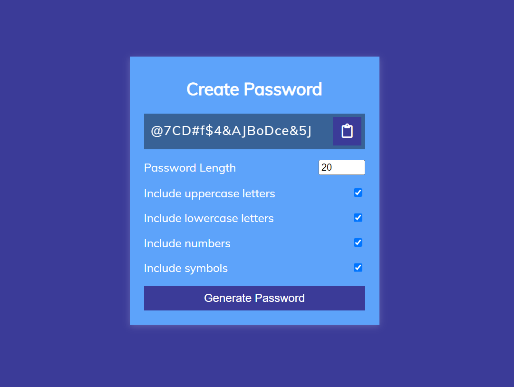

# PasswordGenerator JavaScript_Project

> ### **Deployed Website** :-[Live Link](https://passwordgenerator-jsp.netlify.app/)
 

## Project key takeaways:

  - Used Only **JavaScript**, **Html** and **CSS** for this project.
  - Created a random uppercase letters, lowercase letters, numbers and symbols to generate random password
  - Used DOM to display the generated password on the screen.
  - Use DOM to copy the generated password by clicking the clipboard button.
  - Used if else to assign the checkbox value to the password

   

 
